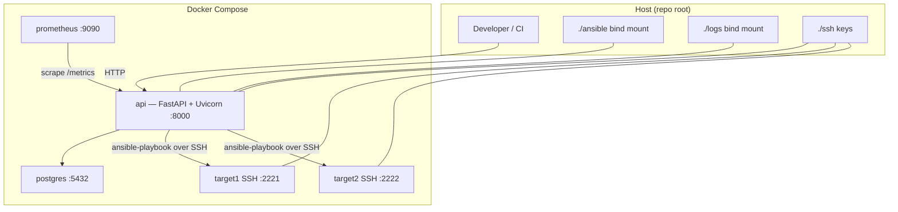

# MuxyLuxy

**Ansible Roller** is a small **FastAPI** control plane for registering **SSH targets** and **Ansible roles**, then **queuing playbook runs** against a local lab stack. The default runtime is **Docker Compose**: Postgres, the API, optional **Prometheus**, and two disposable **SSH targets** for end-to-end checks.

This repository is optimized for **local evaluation**: clone, bring the stack up, run smoke and E2E scripts, and inspect logs and generated Ansible files on disk.

## Architecture (high level)



More detail: [docs/architecture.md](docs/architecture.md).

## Requirements

| Requirement | Notes |
|-------------|--------|
| **Docker** + **Docker Compose** (v2 plugin) | Used for Postgres, API, Prometheus, and SSH targets. |
| **Bash**, **curl**, **jq** | Smoke and E2E scripts assume `jq` for JSON. |
| **OpenSSH client** (`ssh-keygen`) | `scripts/bootstrap.sh` generates `./ssh/id_rsa` if missing. |
| **Python 3** (on the host) | Smoke script uses `python3` for JSON assertions and TCP checks to SSH ports. |

Application runtime inside the API image is **Python 3.12** (see `service/pyproject.toml`).

## Quick start

From the **repository root**:

```bash
cp .env.example .env          # optional; Compose and the app have safe local defaults
./scripts/bootstrap.sh      # ssh keys, logs/, ansible/generated/ (also runs via make up)
docker compose up -d --build
make wait-api                 # or: make wait  (API + SSH ports)
make smoke
```

`make up` runs `docker compose up --build` in the **foreground** (streaming logs). For a single terminal, prefer **`docker compose up -d --build`** after bootstrap, then `make wait-api`, `make smoke`, etc.

- **API:** [http://localhost:8000](http://localhost:8000) — OpenAPI docs at `/docs`.
- **Prometheus UI:** [http://localhost:9090](http://localhost:9090) (if the `prometheus` service is up).

Further local conventions: [docs/local-development.md](docs/local-development.md).

## Default credentials (local only)

| Item | Default | Where to change |
|------|---------|-----------------|
| **API admin** | `admin` / `admin` | `ADMIN_USERNAME`, `ADMIN_PASSWORD` in `.env` or Compose env |
| **JWT signing** | `JWT_SECRET=change-me` | `JWT_SECRET`, `JWT_ALGORITHM`, `JWT_EXPIRE_MINUTES` |
| **Postgres** | `roller` / `roller` (db `roller`) | `POSTGRES_*`, `DATABASE_URL` |
| **SSH targets** (`targets/` image) | User `ansible` with a **known weak password** in the image | Do not expose these ports to untrusted networks |

Treat all defaults as **compromised by design** for a lab. See [docs/security.md](docs/security.md).

## API examples

Replace `TOKEN` with a JWT from `POST /login`.

```bash
# Health (no auth)
curl -sS http://localhost:8000/healthz | jq .

# Login → Bearer token
TOKEN="$(curl -fsS -X POST http://localhost:8000/login \
  -H 'Content-Type: application/json' \
  -d '{"username":"admin","password":"admin"}' | jq -r .access_token)"

curl -fsS http://localhost:8000/me -H "Authorization: Bearer $TOKEN" | jq .

# Register a role (path must exist inside the API container and contain tasks/main.yml)
curl -fsS -X PUT http://localhost:8000/roles/motd \
  -H "Authorization: Bearer $TOKEN" -H 'Content-Type: application/json' \
  -d '{"path":"/opt/ansible/roles/motd","description":"Message of the day"}' | jq .

# Register a target (Compose: use service DNS names target1 / target2, port 22, key path below)
curl -fsS -X PUT http://localhost:8000/targets/target1 \
  -H "Authorization: Bearer $TOKEN" -H 'Content-Type: application/json' \
  -d "$(jq -n \
    --arg host target1 --arg user ansible --arg key /opt/roller/ssh/id_rsa \
    '{host:$host,port:22,username:$user,auth_type:"ssh_key",ssh_private_key_path:$key,python_interpreter:"/usr/bin/python3"}')" | jq .

# Queue a run (role must exist, be enabled, and target must exist)
curl -fsS -X POST http://localhost:8000/run \
  -H "Authorization: Bearer $TOKEN" -H 'Content-Type: application/json' \
  -d '{"target_name":"target1","role_name":"motd"}' | jq .

# Recent run status
curl -fsS 'http://localhost:8000/status?limit=20' -H "Authorization: Bearer $TOKEN" | jq .

# Run log (after the worker has written log_path)
curl -fsS 'http://localhost:8000/logs?run_id=YOUR_RUN_ID' -H "Authorization: Bearer $TOKEN" | jq .

# Prometheus scrape endpoint (no auth — see limitations)
curl -sS http://localhost:8000/metrics | head
```

## Test commands

| Command | What it runs |
|---------|----------------|
| `make test` | `pytest` **inside** the `api` container (`scripts/test.sh`) — unit-style tests hitting the FastAPI app. |
| `make smoke` | Host-side `scripts/smoke-test.sh` — health, auth, targets/roles CRUD, `/status`, TCP to **2221** / **2222**. |
| `make e2e` | `scripts/e2e-run-role.sh` — seeds demo targets/roles, queues **three** runs, polls until success or failure. |
| `make verify` | `lint` + `test` + `smoke` + `e2e` (full local gate). |
| `make e2e-local` | E2E against an API running on the **host** (sets `ROLLER_ROLES_ROOT` and `ROLLER_SSH_KEY_PATH`). |

Details: [docs/testing.md](docs/testing.md).

### End-to-end example (copy-paste)

```bash
cp .env.example .env
make up                       # foreground logs; use another terminal for the next steps, OR use: docker compose up -d --build
make wait-api
make smoke
make e2e
```

If `make up` is blocking, open a **second shell** in the same repo, or run `docker compose up -d --build` after `./scripts/bootstrap.sh`.

## Known limitations

- **Lab security model:** default passwords, JWT secret, SSH target password auth, and **`GET /metrics` without auth** are intentional for local review only.
- **Run execution:** `POST /run` uses **FastAPI `BackgroundTasks`** (in-process). Restarts drop queued work; there is no distributed queue.
- **Ansible:** **`ANSIBLE_HOST_KEY_CHECKING=False`** in the worker for convenience; not appropriate for production without compensating controls.
- **SSH key paths:** role paths are constrained under `ANSIBLE_ROLES_PATH`; stored **target private key paths** are validated for safe **inventory** characters but **not** allow-listed to a root directory (trusted-operator model).
- **`make up`** attaches to container logs and does not return until you stop the stack.

## Bonus features

- **Prometheus** scrapes `GET /metrics` (counters for runs and HTTP traffic, gauge for active runs, histogram for duration). See `prometheus/prometheus.yml` and `service/app/metrics/prometheus.py`.
- **Makefile helpers:** `make wait-targets`, `make check-ssh`, `make check-ansible-ping`, `make reset`, `make logs`, `make ps`, `make lint`, `make format`.
- **Two SSH targets** on fixed host ports **2221** / **2222** for repeatable smoke and multi-host demos.
- **Soft-disable roles:** `DELETE /roles/{name}` sets `enabled: false` (see smoke script).

## Documentation index

| Document | Contents |
|----------|-----------|
| [docs/architecture.md](docs/architecture.md) | Service layout, containers, run lifecycle, data flow |
| [docs/security.md](docs/security.md) | JWT, passwords, roles, paths, SSH keys, local compromises, production |
| [docs/tradeoffs.md](docs/tradeoffs.md) | Compose vs K8s, background tasks vs workers, logging, Postgres HA, role registry |
| [docs/testing.md](docs/testing.md) | Unit, API, smoke, E2E, manual checks |
| [docs/local-development.md](docs/local-development.md) | Bind mounts, directories, workflow notes |

## Repository layout

| Path | Purpose |
|------|---------|
| `service/` | FastAPI app, Alembic migrations, Dockerfile, tests |
| `ansible/` | Roles and generated playbooks/inventory (mounted at `/opt/ansible` in the API container) |
| `targets/` | Debian-based **sshd** image for `target1` / `target2` |
| `prometheus/` | Prometheus scrape config |
| `scripts/` | Bootstrap, wait, smoke, E2E, lint, reset |
| `docs/` | Architecture, security, testing, tradeoffs |
| `ssh/` | Generated key material (gitignored private key); mounted read-only into API and targets |
| `logs/` | Per-run ansible logs from the API worker |
