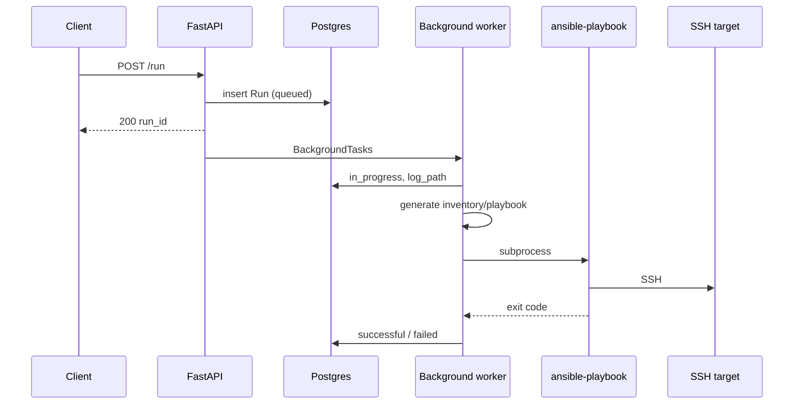

# Architecture

MuxyLuxy ships as a **local Docker Compose stack**: a **FastAPI** API, **Postgres**, optional **Prometheus**, and two **SSH targets** used to exercise Ansible runs. The same app code runs under **`service/`** and is packaged in the **`api`** image.

## Service layout (`service/`)

| Area | Responsibility |
|------|----------------|
| `app/main.py` | FastAPI app, lifespan (admin seed), `/healthz`, router includes |
| `app/config.py` | `pydantic-settings` — DB URL, JWT, Ansible paths, log dir, run timeout |
| `app/database.py`, `app/models.py` | SQLAlchemy session and ORM models (`User`, `Target`, `Role`, `Run`) |
| `app/auth.py` | Password hashing, JWT create/decode, OAuth2 bearer dependency, admin seed |
| `app/api/login.py` | `POST /login` |
| `app/api/targets.py` | CRUD-style `PUT`/`GET`/`DELETE` for targets |
| `app/api/roles.py` | Role registry: list, upsert with path validation, soft delete |
| `app/api/runs.py` | `POST /run` — validates target/role, persists run, schedules background worker |
| `app/api/logs.py` | `GET /status`, `GET /logs` |
| `app/ansible/` | Inventory/playbook generation, path validation, **`ansible-playbook` subprocess** |
| `app/metrics/prometheus.py` | `/metrics` + request counter middleware |
| `alembic/` | Schema migrations |
| `tests/` | `pytest` + `TestClient` API tests |

## Container architecture (Compose)

| Service | Role | Notes |
|---------|------|--------|
| `postgres` | Primary datastore | Postgres **16**; **healthcheck** gates `api` startup. Named volume `postgres_data`. Published **5432** on the host. |
| `api` | HTTP control plane | Image built from `service/Dockerfile`. Uvicorn on **8000**. Env fixes Ansible paths to **`/opt/ansible`** (roles, generated) and logs to **`/app/logs`**. Bind mounts: `./ansible` → `/opt/ansible`, `./logs` → `/app/logs`, `./ssh` → `/opt/roller/ssh_keys` (read-only). **Entrypoint** copies the private key to `/opt/roller/ssh/id_rsa` with mode **600** so OpenSSH accepts it. |
| `prometheus` | Metrics TSDB + UI | Scrapes `http://api:8000/metrics`. Host port **9090** (override with `PROMETHEUS_PORT`). Volume `prometheus_data`. |
| `target1`, `target2` | SSH endpoints | Same image from `targets/`; **sshd** on port **22** inside the container, published as **2221** and **2222** on the host. Mount `./ssh` for authorized-keys style lab access. |

### `targets/` image

Minimal **Debian Bookworm** SSH server: `openssh-server`, `python3`, `sudo`; user **`ansible`** with passwordless sudo for `become` tests. See `targets/sshd_config` and the Dockerfile for the exact lab configuration.

### Repo vs engine data

- **Postgres** and **Prometheus** time series live in **named volumes** (not committed).
- **Ansible tree, logs, and SSH keys** live under the repo on the host and are **bind-mounted** so you can inspect generated playbooks and run logs without `docker exec`.

## Run lifecycle

1. **Client** calls `POST /run` with `target_name` and `role_name`.
2. **API** loads `Target` and `Role` from Postgres; returns **404** if missing, **400** if the role is disabled (`enabled: false`).
3. A **`Run`** row is inserted with status **`queued`**, then **`BackgroundTasks`** invokes **`execute_run_background(run.id)`** after the response is sent.
4. The worker sets status **`in_progress`**, writes **`log_path`**, generates inventory + playbook under **`ANSIBLE_GENERATED_PATH`**, and runs **`ansible-playbook`** with stdout/stderr appended to the log file. Timeout is governed by **`ANSIBLE_RUN_TIMEOUT_SECONDS`**.
5. On completion, status becomes **`successful`** or **`failed`**; **`exit_code`**, **`finished_at`**, and optional **`error_message`** are persisted. Prometheus counters/histograms update on terminal states.

## Data flow

| Flow | Path |
|------|------|
| **Authentication** | `POST /login` verifies password hash → issues **JWT** (`sub` = username). Protected routes use **`Authorization: Bearer`** and load `User` from the DB. |
| **Target / role configuration** | JSON bodies → validated by Pydantic → persisted in **Postgres**. Role **filesystem paths** are resolved and checked to sit under **`ANSIBLE_ROLES_PATH`** and include **`tasks/main.yml`**. |
| **Run orchestration** | `POST /run` → new **`runs`** row → worker reads **`targets`** + **`roles`** → writes **`ansible/generated/<run_id>/`** → **`ansible-playbook`** → **`logs/<run_id>.log`** (path stored on the run). |
| **Observability** | In-process **`prometheus_client`** exposes **`GET /metrics`**. The **`prometheus`** container scrapes that endpoint and retains time series. |

### Why both in-app metrics and a Prometheus container?

They answer different questions and are not interchangeable:

1. **`service/app/metrics/`** — lives **inside the API process**: defines metric families, increments them when runs and HTTP requests occur, and serves the current snapshot at **`GET /metrics`**.
2. **`prometheus/` + Compose `prometheus` service** — a separate **scraper + TSDB**: pulls `/metrics` on an interval, stores history, and serves the **9090** UI and PromQL.

You can curl **`/metrics`** without running Prometheus; you cannot get retention and alerting without a scraper or remote write sink.

### Metrics exposed today

| Metric | Type | Meaning |
|--------|------|--------|
| `ansible_roller_runs_total` | Counter | `status` label: `successful` or `failed`. Terminal background runs (including early failures such as missing target/role). |
| `ansible_roller_active_runs` | Gauge | Runs in the worker path after `in_progress` is set. |
| `ansible_roller_run_duration_seconds` | Histogram | Wall time from `in_progress` through worker completion. |
| `ansible_roller_api_requests_total{method,path}` | Counter | Per-request HTTP counts (path is the literal URL path). |

## Network shape (local)

Compose provides a **flat bridge network**: the API resolves **`postgres`**, **`target1`**, and **`target2`** by service name. Smoke tests on the **host** use **localhost:8000** and **127.0.0.1:2221 / 2222** so they validate **published ports**, matching developer and lightweight CI workflows.
